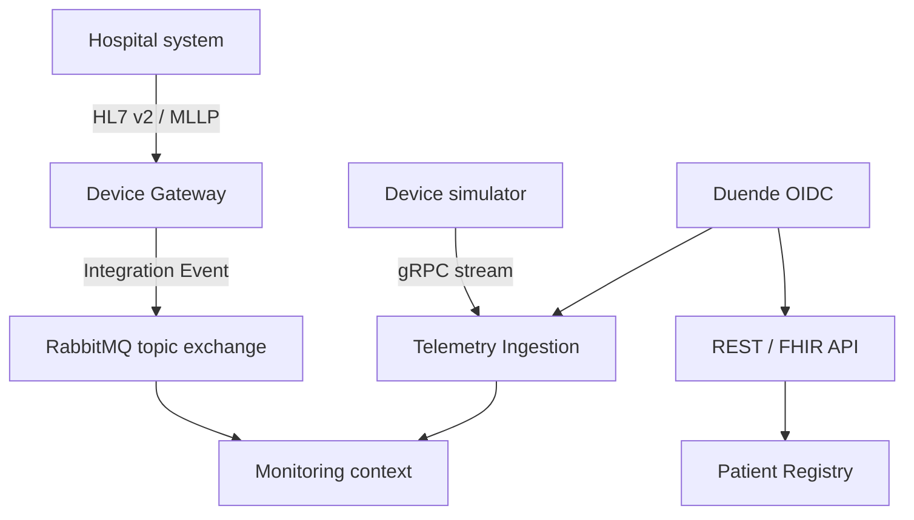

# PulseGuard Platform

PulseGuard est une plateforme pédagogique de monitoring médical construite avec .NET 10 et C# 14. Le dépôt sert de laboratoire exécutable pour les pratiques de Lead Developer, Software Architect, Solution Architect, System Architect et Principal Engineer.

> [!WARNING]
> PulseGuard utilise exclusivement des données synthétiques. Ce logiciel n'est pas un dispositif médical, ne fournit aucun diagnostic et ne doit pas traiter de données de santé réelles.

## Premier vertical slice

Le socle exécutable couvre déjà plusieurs styles de communication, chacun associé à un besoin précis :

| Canal | Usage | Projet ou contrat |
|---|---|---|
| REST/OpenAPI | Enregistrement et consultation des patients | `PulseGuard.PatientRegistry.Api` |
| FHIR R4 | Projection interopérable d'un patient | `/fhir/Patient/{id}` |
| HL7 v2.x/MLLP | Réception de messages hospitaliers legacy sur TCP | `PulseGuard.DeviceGateway` |
| gRPC client streaming | Ingestion efficace des constantes vitales | `PulseGuard.Telemetry.Grpc` |
| OIDC/OAuth 2.0 | Authentification machine-to-machine et scopes | `PulseGuard.Identity`, basé sur Duende |
| Integration Events | Publication durable et confirmée vers un topic exchange RabbitMQ | `PulseGuard.Framework.Messaging.RabbitMq` |



L'architecture complète est décrite dans [docs/architecture/overview.md](docs/architecture/overview.md). Les choix structurants sont enregistrés dans [docs/adr](docs/adr).

## Environnement Windows

- .NET SDK `10.0.108` ou feature band .NET 10 stable supérieur, tel que `10.0.300`, conformément à `global.json` ;
- Node.js 22 ou supérieur pour Husky et Commitlint ;
- Git for Windows et GitHub CLI (`gh`) ;
- PowerShell 7 recommandé ;
- un certificat HTTPS de développement (`dotnet dev-certs https --trust`) ;
- Docker Desktop pour PostgreSQL, RabbitMQ et l'OpenTelemetry Collector.

Le workflow développeur et la CI sont Windows-first. Les projets .NET restent portables, mais toutes les commandes documentées et automatisées utilisent PowerShell.

## Vérification locale

```powershell
npm install
npm run prepare
.\eng\initialize-development.ps1
.\eng\verify.ps1
```

Le script génère des secrets aléatoires, conserve les credentials d'infrastructure dans le fichier local `.env` ignoré par Git et enregistre la chaîne PostgreSQL ainsi que le mot de passe RabbitMQ avec `.NET User Secrets`. Le secret client Duende est copié dans le presse-papiers Windows afin de le transférer dans la variable Postman `clientSecret`, marquée comme secret, sans l'afficher dans le terminal. Aucune credential n'est versionnée.

Les migrations PostgreSQL peuvent aussi être appliquées explicitement :

```powershell
.\eng\apply-migrations.ps1
```

## Démarrage local

```powershell
dotnet dev-certs https --trust
.\eng\start-platform.ps1
```

La collection [Postman](postman/collections/PulseGuard.postman_collection.json) demande un token `client_credentials`, crée un patient synthétique et interroge sa projection FHIR.

## Qualité et sécurité

- `Nullable`, analyzers et warnings-as-errors sont activés globalement ;
- `.editorconfig` est la source de vérité pour le style C# ;
- Husky exécute restore, format, build et tests avant un commit ;
- Commitlint impose les Conventional Commits ;
- les tests suivent xUnit, AutoFixture, AutoFixture.AutoNSubstitute, NSubstitute et FluentAssertions ;
- les payloads cliniques bruts et les secrets ne sont jamais journalisés ;
- le listener MLLP est lié à loopback par défaut, limite la taille des messages et impose un timeout ;
- les certificats, secrets et données de développement ne sont pas des valeurs de production.

## Branching et commits

Le dépôt utilise un feature branching centré sur `develop` :

```text
main <- release/* <- develop <- feature/* | fix/*
```

Les branches de travail passent par une Pull Request vers `develop`. Les releases passent ensuite de `release/*` vers `main`, puis sont réintégrées dans `develop`. Les messages de commit et les commentaires de code sont en anglais.

Exemples :

```text
feat(hl7): add bounded mllp frame decoder
fix(identity): reject tokens with an invalid audience
docs(adr): explain duende identityserver selection
```

Voir [CONTRIBUTING.md](CONTRIBUTING.md) pour les règles complètes.

## Standards et références

- [Duende IdentityServer 8](https://docs.duendesoftware.com/identityserver/)
- [gRPC pour ASP.NET Core](https://learn.microsoft.com/aspnet/core/grpc/)
- [FHIR R4](https://hl7.org/fhir/R4/)
- [HL7 standards](https://www.hl7.org/implement/standards/)

La licence MIT du dépôt ne remplace pas les conditions de licence de Duende IdentityServer. Vérifier la licence Duende correspondant au contexte d'utilisation avant tout usage commercial.
