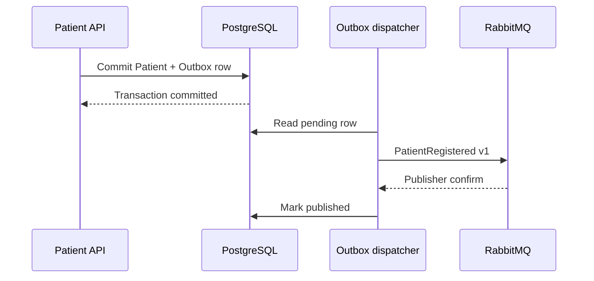
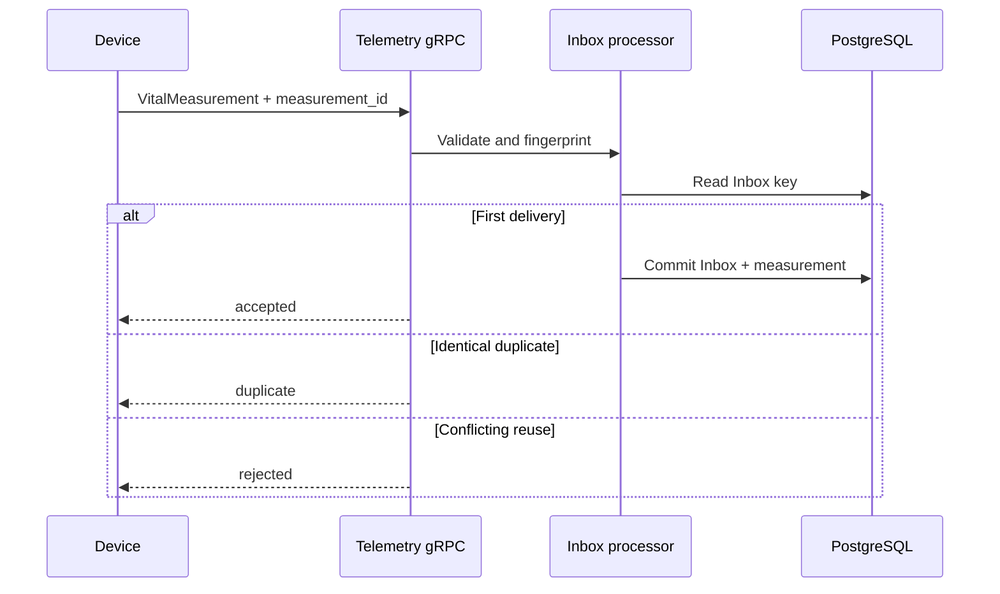
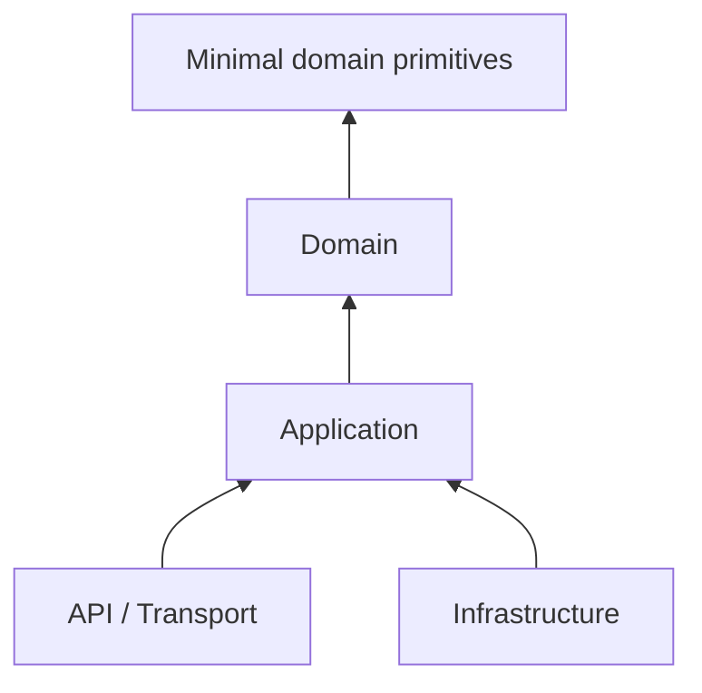
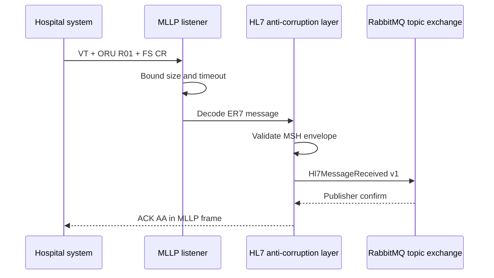
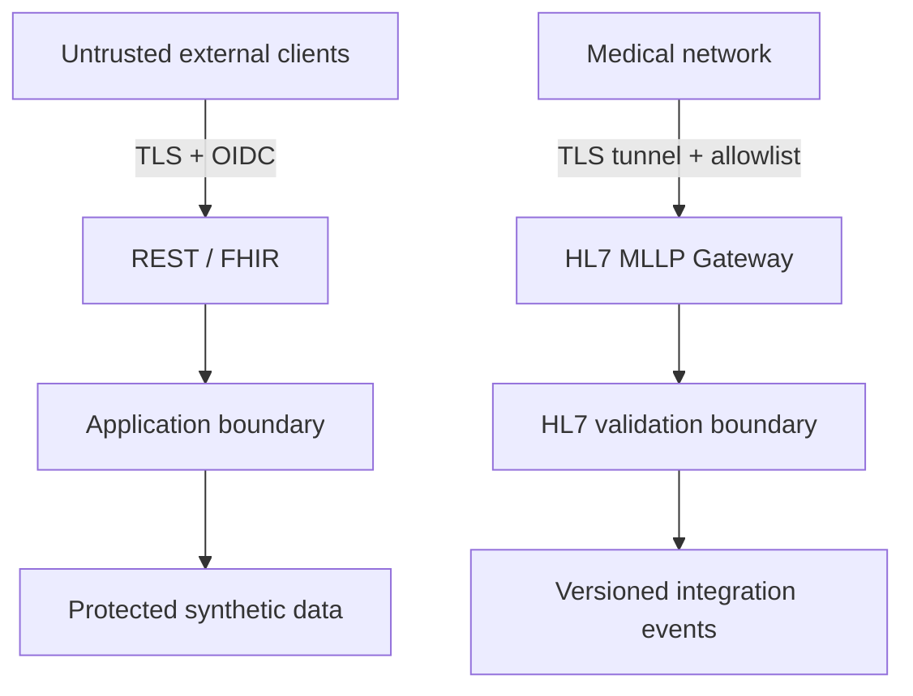

# Architecture de PulseGuard

## Objectif

PulseGuard apprend à faire évoluer un système sans confondre organisation logique et topologie de déploiement. Les `Bounded Contexts` sont séparés dans le code ; leur extraction en services indépendants doit être justifiée par la charge, l'autonomie, le rythme de changement ou l'isolation des risques.

## Contextes prévus

| Bounded Context | Responsabilité | État |
|---|---|---|
| Patient Registry | Identité clinique minimale du patient | PostgreSQL persistant |
| Device Management | Enregistrement et affectation des dispositifs | Planifié |
| Telemetry | Ingestion de mesures volumineuses | Contrat gRPC initial |
| Monitoring | Sessions, règles et détection des seuils | Planifié |
| Alerting | Cycle de vie et escalade des alertes | Planifié |
| Notifications | Canaux et préférences de notification | Planifié |
| Interoperability | HL7 v2, FHIR et Anti-Corruption Layer | Premier slice |
| Audit | Accès et actions sensibles | Planifié |

## Observabilité

Tous les hosts utilisent le building block `PulseGuard.Framework.Observability`. Il enrichit les logs, métriques et traces avec le nom du service, sa version et l'environnement, puis les exporte en OTLP lorsque l'export est activé. Le collecteur local écoute sur les ports `4317` et `4318` et utilise un exporter `debug` afin de garder la Phase 1 indépendante d'un backend d'observabilité particulier.

Les attributs de télémétrie ne doivent jamais contenir un payload HL7 brut, un secret ou une donnée clinique. Les identifiants techniques et les types de messages sont autorisés lorsqu'ils sont nécessaires au diagnostic.

## Persistance Patient Registry

L'Application dépend uniquement de `IPatientRepository`. L'Infrastructure fournit `PostgresPatientRepository` avec EF Core et Npgsql, un mapping explicite du strong ID `PatientId`, une contrainte unique sur le numéro de dossier médical et des migrations versionnées. Le schema PostgreSQL `patient_registry` évite le couplage de tables entre bounded contexts.

## Outbox et Inbox transactionnelles

Le building block `PulseGuard.Framework.Messaging.EntityFrameworkCore` ajoute deux primitives locales à chaque contexte persistant :

- l'Outbox conserve l'intention de publier un Integration Event dans la même transaction que l'agrégat ;
- l'Inbox utilise l'ID de l'événement comme clé d'idempotence et conserve une empreinte SHA-256 du contenu ;
- le dispatcher ne marque un message publié qu'après la confirmation RabbitMQ ;
- un doublon reste possible si le processus s'arrête entre la confirmation du broker et la mise à jour PostgreSQL.

Le processeur de télémétrie applique ce contrat en enregistrant l'Inbox et la mesure dans une seule transaction. Les retries avec jitter et la DLQ restent des incréments distincts de la Phase 2.

## Ingestion de télémétrie idempotente

Chaque `VitalMeasurement` gRPC porte un `measurement_id` généré à la source. Telemetry utilise cet identifiant comme clé de la mesure et comme clé d'Inbox :

- une première livraison valide crée la mesure et marque l'Inbox traitée dans le même commit PostgreSQL ;
- une livraison identique retourne `duplicate` sans rejouer l'effet métier ;
- le même identifiant associé à un contenu différent est rejeté comme conflit ;
- chaque mesure du stream utilise un `DbContext` isolé afin qu'un échec ne contamine pas la mesure suivante.

La valeur clinique brute et l'identifiant patient ne sont jamais écrits dans les logs ou les attributs OpenTelemetry. Seuls les IDs techniques, le type de mesure et le device technique sont utilisés pour le diagnostic.

## Clean Architecture d'un contexte

- `Domain` contient les invariants et ne connaît aucun transport ni stockage.
- `Application` orchestre les use cases avec CQRS et dépend de ports.
- `Infrastructure` implémente les ports sans remonter dans le Domain.
- `API` traduit les contrats externes vers l'Application.
- `Contracts` ne fuite pas les entities ni les aggregates.

Les tests d'architecture rendent ces règles exécutables.

## Flux HL7 v2 entrant

Le Device Gateway publie l'événement versionné dans le topic exchange durable `pulseguard.events`. Le message est persistant et le publisher attend la confirmation du broker avant de retourner un ACK `AA`. Cette confirmation protège le transfert vers RabbitMQ, mais ne rend pas atomiques le traitement HL7 et la publication, car ce gateway ne possède encore aucun stockage local. Les payloads bruts ne sont ni propagés ni journalisés.

## Trust boundaries

MLLP ne fournit ni chiffrement ni identité applicative par lui-même. Un déploiement réel exigerait un tunnel TLS ou mTLS, une segmentation réseau, des allowlists et une authentification adaptée en amont du listener.

## Règles de dépendance

- aucun package Framework ne contient de modèle médical partagé ;
- un Integration Event est un contrat versionné, pas un Domain Event sérialisé ;
- une mesure de télémétrie n'est pas automatiquement un Domain Event ;
- les adapters HL7 et FHIR protègent le Domain via une Anti-Corruption Layer ;
- les communications synchrones ont un timeout et propagent la cancellation ;
- les consommateurs asynchrones sont conçus pour recevoir des doublons ;
- les logs utilisent des identifiants techniques, jamais le payload clinique brut.
