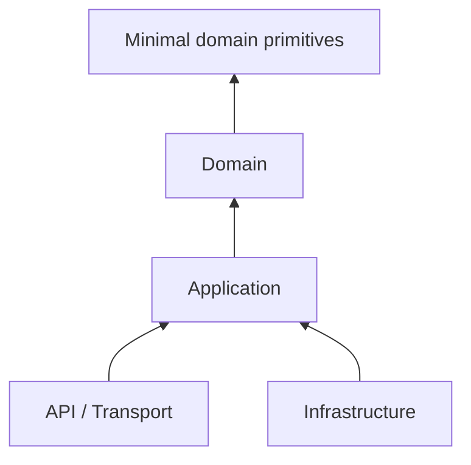
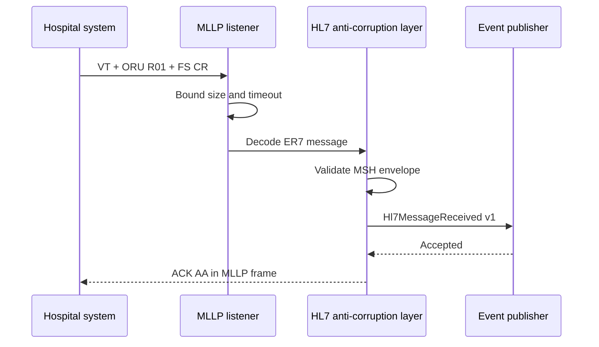
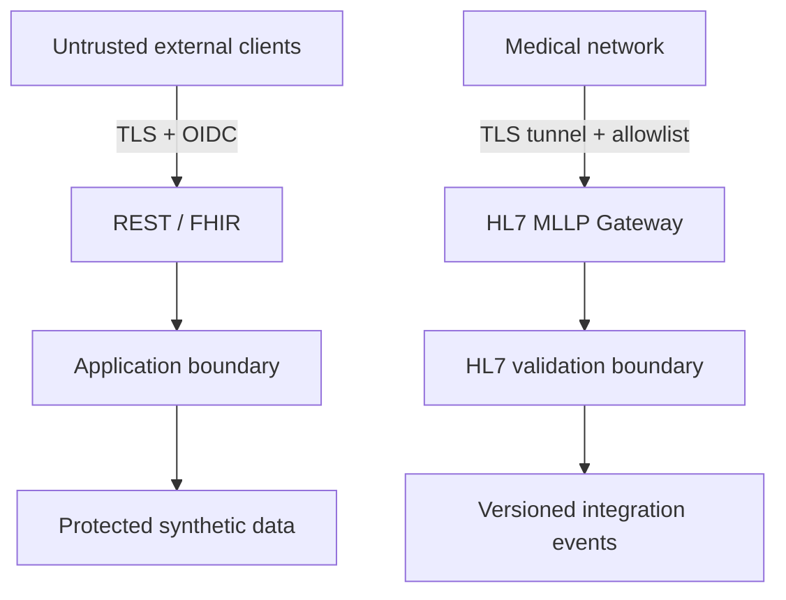

# Architecture de PulseGuard

## Objectif

PulseGuard apprend à faire évoluer un système sans confondre organisation logique et topologie de déploiement. Les `Bounded Contexts` sont séparés dans le code ; leur extraction en services indépendants doit être justifiée par la charge, l'autonomie, le rythme de changement ou l'isolation des risques.

## Contextes prévus

| Bounded Context | Responsabilité | État |
|---|---|---|
| Patient Registry | Identité clinique minimale du patient | Premier slice |
| Device Management | Enregistrement et affectation des dispositifs | Planifié |
| Telemetry | Ingestion de mesures volumineuses | Contrat gRPC initial |
| Monitoring | Sessions, règles et détection des seuils | Planifié |
| Alerting | Cycle de vie et escalade des alertes | Planifié |
| Notifications | Canaux et préférences de notification | Planifié |
| Interoperability | HL7 v2, FHIR et Anti-Corruption Layer | Premier slice |
| Audit | Accès et actions sensibles | Planifié |

## Clean Architecture d'un contexte

- `Domain` contient les invariants et ne connaît aucun transport ni stockage.
- `Application` orchestre les use cases avec CQRS et dépend de ports.
- `Infrastructure` implémente les ports sans remonter dans le Domain.
- `API` traduit les contrats externes vers l'Application.
- `Contracts` ne fuite pas les entities ni les aggregates.

Les tests d'architecture rendent ces règles exécutables.

## Flux HL7 v2 entrant

Le premier slice publie l'événement dans un adapter de log afin de garder le chemin compilable sans broker. L'étape suivante remplacera cet adapter par RabbitMQ avec Outbox/Inbox et idempotence. Les payloads bruts ne sont pas propagés ni journalisés.

## Trust boundaries

MLLP ne fournit ni chiffrement ni identité applicative par lui-même. Un déploiement réel exigerait un tunnel TLS ou mTLS, une segmentation réseau, des allowlists et une authentification adaptée en amont du listener.

## Règles de dépendance

- aucun package Framework ne contient de modèle médical partagé ;
- un Integration Event est un contrat versionné, pas un Domain Event sérialisé ;
- une mesure de télémétrie n'est pas automatiquement un Domain Event ;
- les adapters HL7 et FHIR protègent le Domain via une Anti-Corruption Layer ;
- les communications synchrones ont un timeout et propagent la cancellation ;
- les consommateurs asynchrones sont conçus pour recevoir des doublons ;
- les logs utilisent des identifiants techniques, jamais le payload clinique brut.
